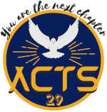

#Acts 29

!!! info "Acts 29: "You are the next chapter""

"**Acts 29**" is the one-day programme conducted by Kozhikode Campus ministry every month. We started the programme from January 2021 and by the grace of God have sucessfully been conducting it for the past 7 months.

Acts 29 is conducted on 3rd Sunday every month.

!!! example ""
    **General Coordinator**: Deslin Prakash

---

##August 2021

!!! tip "Announcement"
    **Date**: 15 August 2021 (3rd Sunday)

    **Time**: 11:00 am IST

    **Theme**: Prolife

    **Platform**: Zoom Cloud Meetings

    **Meeting Link**: *Will be posted soon*

???+ info "Pre-Program"
    

        

            </img>
        

        

        

            </img>
        

    

##July 2021

!!! quote "Matthew 18:20"
    For where two or three are gathered in my name, there am I in the midst of them.

    എന്തെന്നാൽ രണ്ടോ മൂന്നോപേർ എന്റെ നാമത്തിൽ ഒരുമിച്ചു കൂടുന്നിടത്ത് അവരുടെ മധ്യേ ഞാൻ ഉണ്ടായിരിക്കും.

!!! tip "Announcement"
    

        

            </img>
        

    

     
    **Date**:18 July 2021 (3rd Sunday)

    **Time**: 11:00 am IST

    **Theme**: Fellowship

    **Platform**: Zoom Cloud Meetings

??? info "Pre-Program"
    

        

            </img>
        

        

        

            </img>
        

    

##June 2021

!!! quote "Proverbs 14:21"
    He who despises his neighbour is a sinner, but happy is he who is kind to the poor. 

    അയൽക്കാരനെ നിന്ദിക്കുന്നവൻ പാപിയാണ്; പാവപ്പെട്ടവനോടു ദയ കാണിക്കുന്നവൻ ഭാഗ്യവാനും.

!!! tip "Announcement"
    

        

            </img>
        

    

     
    **Date**: 20 June 2021 (3rd Sunday)

    **Time**: 11:30 am IST

    **Theme**: Option for the Poor

    **Platform**: Zoom Cloud Meetings

??? info "Pre-Program"
    

        

            </img>
        

        

        

            </img>
        

    

##May 2021

!!! quote "1 Chronicles 16:11"
    Seek the LORD and his strength, seek his presence continually

    കർത്താവിനെ അന്വേഷിക്കുവിൻ, അവിടുത്തെ ശക്തിയിൽ ആശ്രയിക്കുവിൻ, നിരന്തരം അവിടുത്തെ സാന്നിധ്യം തേടുവിൻ.

!!! tip "Announcement"
    

        

            </img>
        

    

     
    **Date**: 30 May 2021 (5th Sunday)

    **Time**: 11:30 am IST

    **Theme**: Prayer, Word of God, Sacramental Life

    **Platform**: Zoom Cloud Meetings

??? info "Pre-Program"
    

        

            </img>
        

        

        

            </img>
        

    

##April 2021

!!! quote "Acts 1:8"
    You shall receive power when the Holy Spirit has come upon you; and you shall be my witnesses in Jerusalem and in all Judea and Samar′ia and to the end of the earth.
    
    പരിശുദ്ധാത്മാവ് നിങ്ങളുടെമേൽ വന്നുകഴിയുമ്പോൾ നിങ്ങൾ ശക്തിപ്രാപിക്കും. ജറുസലേമിലും യൂദയാ മുഴുവനിലും സമരിയായിലും ഭൂമിയുടെ അതിർത്തികൾ വരെയും നിങ്ങൾ എനിക്കു സാക്ഷികളായിരിക്കുകയും ചെയ്യും.

!!! tip "Announcement"
    

        

            </img>
        

    

     
    **Date**: 25 April 2021 (4th Sunday)

    **Time**: 11:30 am IST

    **Theme**: Holy Spirit

    **Platform**: Zoom Cloud Meetings

??? info "7 Days with Holy Spirit"
    

        

            </img>
        

    

##March 2021

!!! quote "Romans 8:18"
    I consider that the sufferings of this present time are not worth comparing with the glory that is to be revealed to us.

    നമുക്ക് വെളിപ്പെടാനിരിക്കുന്ന മഹത്വത്തോടു തുലനം ചെയ്യുമ്പോൾ ഇന്നത്തെ കഷ്ടതകൾ നിസ്സാരമാണെന്നു ഞാൻ കരുതുന്നു.

!!! tip "Announcement"
    

        

            </img>
        

    

     
    **Date**: 21 March 2021 (3rd Sunday)

    **Time**: 10:20 am IST

    **Theme**: Cruxification and Ressurection of Christ

    **Platform**: Zoom Cloud Meetings

??? info "Way of Cross"
    

        

            </img>
        

    

##February 2021

!!! quote "1 John 3:1"
    See what love the Father has given us, that we should be called children of God; and so we are.
    
    കണ്ടാലും! എത്ര വലിയ സ്നേഹമാണു പിതാവു നമ്മോടു കാണിച്ചത്. ദൈവമക്കളെന്നു നാം വിളിക്കപ്പെടുന്നു. നാം അങ്ങനെയാണു താനും.

!!! tip "Announcement"
    

        

            </img>
        

    

     
    **Date**: 21 February 2021 (3rd Sunday)

    **Time**: 10:20 am IST

    **Theme**: Valentine's Day

    **Platform**: Zoom Cloud Meetings

??? info "Pre-Program"
    

        

            </img>
        

        

        

            </img>
        

    

##January 2021

!!! quote "Philippians 4:13"
    I can do all things in Him who strengthens me.
    
    എന്നെ ശക്തനാക്കുന്നവനിലൂടെ എല്ലാം ചെയ്യാൻ എനിക്കു സാധിക്കും.

!!! tip "Announcement"
    

        

            </img>
        

    

     
    **Date**: 24 January 2021 (4th Sunday)

    **Time**: 10:20 am IST

    **Theme**: I can do all things in Him who strengthens me (Philippians 4:13)

    **Platform**: Zoom Cloud Meetings

??? info "Pre-Program"
    

        

            </img>
        

        

        

            </img>
        

    
